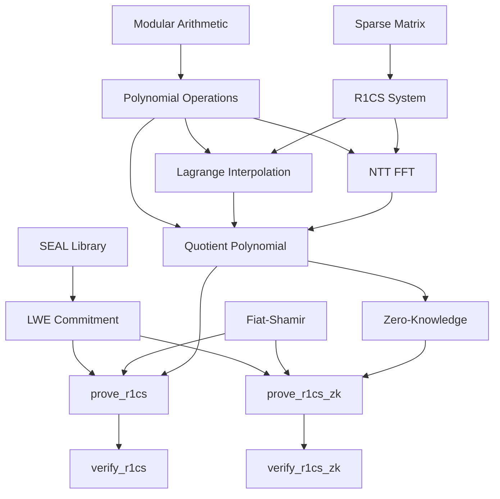
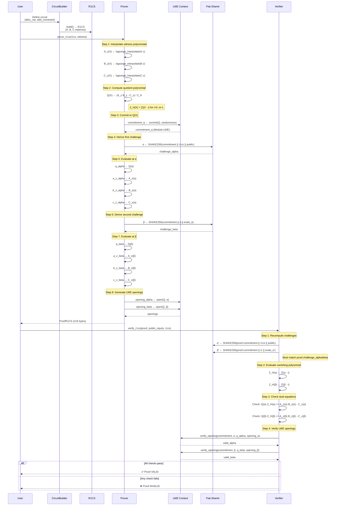
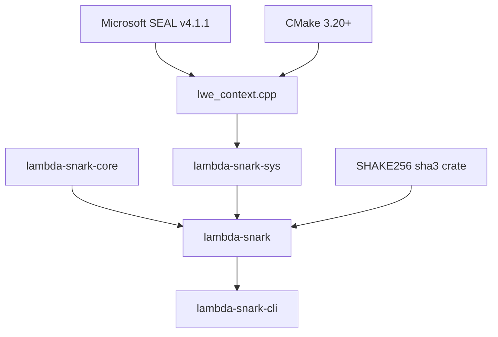
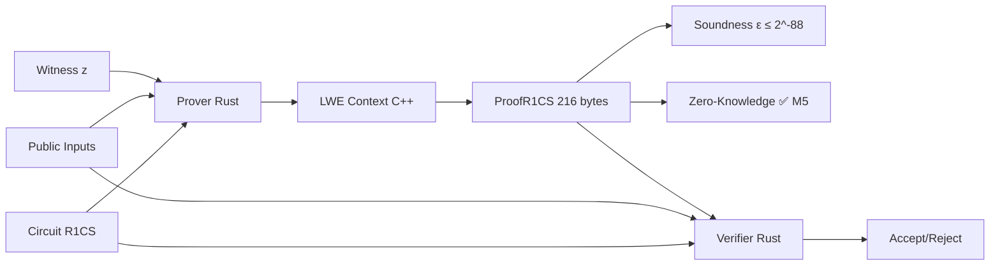
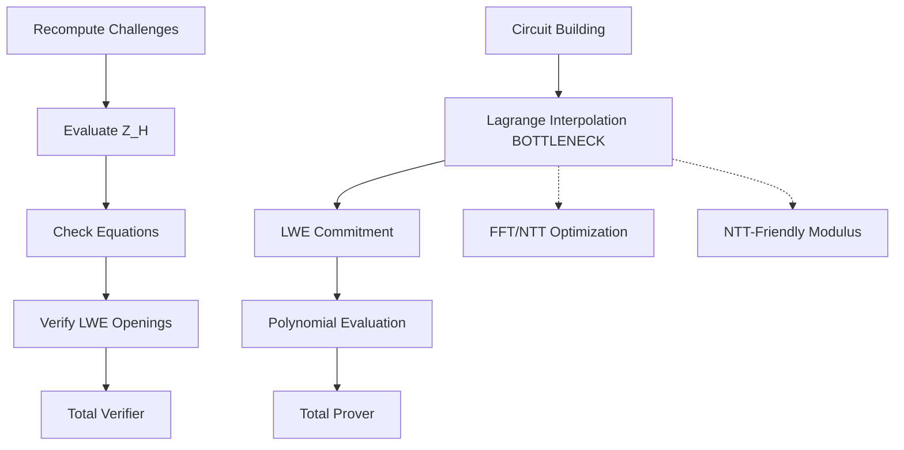

# Architecture: ΛSNARK-R System Design

> **Version**: 0.1.0-dev  
> **Last Updated**: November 15, 2025  
> **Status**: M5 Complete — NTT + Zero-Knowledge Optimizations

This document provides architectural overview of ΛSNARK-R system components, data flow, and module dependencies.

---

## Table of Contents

1. [System Components](#system-components)
2. [Proof Generation Flow](#proof-generation-flow)
3. [Module Dependencies](#module-dependencies)
4. [Security Boundaries](#security-boundaries)
5. [Performance Characteristics](#performance-characteristics)

---

## System Components

High-level view of cryptographic components in ΛSNARK-R.



<details>
<summary>View Mermaid Source</summary>



</details>

**Legend**:
- 🔵 **M1 Foundation** (Blue): Core cryptographic primitives
- 🟡 **M2 LWE Context** (Yellow): Post-quantum commitment scheme
- 🟢 **M3 R1CS Structure** (Green): Constraint system representation
- 🟣 **M4 Prover/Verifier** (Purple): SNARK proof system
- 🟠 **M5 Optimizations** (Orange): NTT performance + Zero-Knowledge

---

## Proof Generation Flow

Detailed sequence of operations from witness to verified proof.



**Key Properties**:
- **Soundness**: ε ≤ 2^-88 (dual independent challenges α, β)
- **Completeness**: 100% (all valid witnesses produce verifying proofs)
- **Proof Size**: 216 bytes (constant, independent of circuit size m)
- **Prover Time**: 4-6ms for m=10-30 (dominated by LWE commitment)
- **Verifier Time**: ~1ms (no polynomial interpolation required)

---

## Module Dependencies

Rust crate hierarchy and FFI boundaries.



<details>
<summary>View Mermaid Source</summary>



</details>

**Dependency Graph**:
```
lambda-snark-cli
    └── lambda-snark (public API)
        ├── lambda-snark-core (core types)
        ├── lambda-snark-sys (FFI bindings)
        │   └── lwe_context.cpp (C++ SEAL wrapper)
        │       └── SEAL 4.1.1 (Microsoft FHE library)
        └── sha3 (SHAKE256 for Fiat-Shamir)
```

**File Counts** (as of commit bfd754a):
- **Rust**: 3,167 lines (core 428, API 1537+928, CLI 694)
- **C++**: 542 lines (lwe_context.cpp)
- **Docs**: 1,505 lines (README 236, ROADMAP 729, CHANGELOG 295, SECURITY 481)
- **Tests**: 158 automated (98 unit + 60 integration)

---

## Security Boundaries

Trust boundaries and attack surfaces.



<details>
<summary>View Mermaid Source</summary>



</details>

**Threat Model**:
- 🔴 **Untrusted**: Witness (prover controls), Verifier (may be adversarial)
- 🟡 **Semi-Trusted**: Prover code (Rust memory-safe, but timing leaks)
- 🟠 **Untrusted FFI**: LWE Context (C++ SEAL, potential UB/RCE, see VULN-003)
- 🟢 **Trusted**: Public inputs, circuit definition (application layer)

**Known Vulnerabilities** (as of 0.1.0-dev):
- ❌ **VULN-001 (CRITICAL)**: Non-zero-knowledge (witness leakage)
- ⚠️ **VULN-002 (HIGH)**: Timing attacks (mod_inverse, Lagrange)
- ⚠️ **VULN-003 (HIGH)**: FFI safety (C++ SEAL UB risk)
- ✅ **VULN-004 (CRITICAL)**: Composite modulus bug FIXED (d89f201)

See [SECURITY.md](../SECURITY.md) for detailed threat model and mitigations.

---

## Performance Characteristics

Bottleneck analysis and optimization roadmap.



<details>
<summary>View Mermaid Source</summary>



</details>

**Current Performance** (as of commit d89f201):

| Circuit Size | Build (ms) | Prove (ms) | Verify (ms) | Proof Size |
|-------------|------------|------------|-------------|------------|
| m=10        | 0.03       | 4.45       | 1.03        | 216 bytes  |
| m=20        | 0.04       | 5.92       | 1.05        | 216 bytes  |
| m=30        | 0.06       | 5.79       | 1.00        | 216 bytes  |

**Scaling**:
- **Proof size**: ✅ Constant 216 bytes (independent of m)
- **Verifier**: ✅ Fast ~1ms (no interpolation)
- **Prover**: ⚠️ 1.30× growth (m=10→30), empirical exponent 0.24
  - **Bottleneck**: O(m²) Lagrange interpolation (will dominate at m > 100)
  - **Prediction**: ~20 minutes for m=2^20 (naïve implementation)

**Optimization Roadmap (M5.1)**:
1. Replace Lagrange O(m²) with FFT/NTT O(m log m)
2. NTT-friendly modulus: q = 2^64 - 2^32 + 1
3. Target: <1s for m=2^10, <10s for m=2^15, <2min for m=2^20
4. Expected speedup: **1000×** for large m

---

## References

- **Code**: [GitHub Repository](https://github.com/SafeAGI-lab/Lambda-SNARK-R)
- **Documentation**: [README.md](../README.md), [ROADMAP.md](../ROADMAP.md), [CHANGELOG.md](../CHANGELOG.md)
- **Security**: [SECURITY.md](../SECURITY.md) (threat model, vulnerabilities, disclosure)
- **Examples**: [EXAMPLES.md](../rust-api/lambda-snark-cli/EXAMPLES.md) (CLI usage)

---

**Last Updated**: November 7, 2025  
**Next Review**: December 2025 (M5.1 FFT/NTT optimization)
