# Architecture: ΛSNARK-R System Design

> **Version**: 0.1.0-dev  
> **Last Updated**: November 15, 2025  
> **Status**: M5 Complete — NTT + Zero-Knowledge Optimizations

This document provides architectural overview of ΛSNARK-R system components, data flow, and module dependencies.

---

## Table of Contents

1. [System Components](#system-components)
2. [Proof Generation Flow](#proof-generation-flow)
3. [Module Dependencies](#module-dependencies)
4. [Security Boundaries](#security-boundaries)
5. [Performance Characteristics](#performance-characteristics)

---

## System Components

High-level view of cryptographic components in ΛSNARK-R.

```mermaid
flowchart TB
    subgraph "M1: Foundation"
        MOD[Modular Arithmetic<br/>mod_add, mod_mul, mod_inverse<br/>F_q operations]
        POLY[Polynomial Operations<br/>poly_add, poly_mul, poly_eval<br/>F_q[X] ring]
    end
    
    subgraph "M2: LWE Context"
        SEAL[SEAL Library<br/>Microsoft FHE<br/>C++ implementation]
        LWE[LWE Commitment<br/>commit, verify_opening<br/>Module-LWE hardness]
        FS[Fiat-Shamir<br/>SHAKE256 challenges<br/>Random Oracle Model]
    end
    
    subgraph "M3: R1CS Structure"
        SPARSE[Sparse Matrix<br/>A, B, C matrices<br/>~24 bytes/entry]
        R1CS[R1CS System<br/>Az ⊙ Bz = Cz<br/>constraint satisfaction]
    end
    
    subgraph "M4: R1CS Prover/Verifier"
        LAGRANGE[Lagrange Interpolation<br/>O(m²) polynomial ops<br/>witness → polynomials]
        QUOTIENT[Quotient Polynomial<br/>Q = (Az·Bz - Cz) / Z_H<br/>core proving operation]
        PROVER[prove_r1cs<br/>216-byte proofs<br/>dual-challenge soundness]
        VERIFIER[verify_r1cs<br/>~1ms verification<br/>ε ≤ 2^-88]
    end
    
    subgraph "M5: Optimizations"
        NTT[Cooley-Tukey NTT<br/>O(m log m) FFT<br/>1000× speedup]
        ZK[Zero-Knowledge<br/>Q'(X) = Q(X) + r·Z_H(X)<br/>polynomial blinding]
        PROVER_ZK[prove_r1cs_zk<br/>224-byte ZK proofs<br/>witness hiding]
        VERIFIER_ZK[verify_r1cs_zk<br/>unblinding verification<br/>ε ≤ 2^-48]
    end
    
    MOD --> POLY
    POLY --> LAGRANGE
    POLY --> NTT
    POLY --> QUOTIENT
    SEAL --> LWE
    LWE --> PROVER
    LWE --> PROVER_ZK
    FS --> PROVER
    FS --> PROVER_ZK
    SPARSE --> R1CS
    R1CS --> LAGRANGE
    R1CS --> NTT
    LAGRANGE --> QUOTIENT
    NTT --> QUOTIENT
    QUOTIENT --> PROVER
    QUOTIENT --> ZK
    ZK --> PROVER_ZK
    PROVER --> VERIFIER
    PROVER_ZK --> VERIFIER_ZK
    
    style MOD fill:#e1f5ff
    style POLY fill:#e1f5ff
    style SEAL fill:#fff4e1
    style LWE fill:#fff4e1
    style FS fill:#fff4e1
    style SPARSE fill:#e8f5e9
    style R1CS fill:#e8f5e9
    style LAGRANGE fill:#f3e5f5
    style QUOTIENT fill:#f3e5f5
    style PROVER fill:#f3e5f5
    style VERIFIER fill:#f3e5f5
    style NTT fill:#ffe0b2
    style ZK fill:#ffe0b2
    style PROVER_ZK fill:#ffe0b2
    style VERIFIER_ZK fill:#ffe0b2
```

**Legend**:
- 🔵 **M1 Foundation** (Blue): Core cryptographic primitives
- 🟡 **M2 LWE Context** (Yellow): Post-quantum commitment scheme
- 🟢 **M3 R1CS Structure** (Green): Constraint system representation
- 🟣 **M4 Prover/Verifier** (Purple): SNARK proof system
- 🟠 **M5 Optimizations** (Orange): NTT performance + Zero-Knowledge

---

## Proof Generation Flow

Detailed sequence of operations from witness to verified proof.

```mermaid
sequenceDiagram
    participant User
    participant CircuitBuilder
    participant R1CS
    participant Prover
    participant LWE as LWE Context
    participant FS as Fiat-Shamir
    participant Verifier
    
    User->>CircuitBuilder: Define circuit<br/>(alloc_var, add_constraint)
    CircuitBuilder->>R1CS: build() → R1CS<br/>(A, B, C matrices)
    
    User->>Prover: prove_r1cs(r1cs, witness)
    
    Note over Prover: Step 1: Interpolate witness polynomials
    Prover->>Prover: A_z(X) ← lagrange_interpolate(A·z)
    Prover->>Prover: B_z(X) ← lagrange_interpolate(B·z)
    Prover->>Prover: C_z(X) ← lagrange_interpolate(C·z)
    
    Note over Prover: Step 2: Compute quotient polynomial
    Prover->>Prover: Q(X) ← (A_z·B_z - C_z) / Z_H
    Note right of Prover: Z_H(X) = ∏(X - i) for i=0..m-1
    
    Note over Prover: Step 3: Commit to Q(X)
    Prover->>LWE: commitment_q ← commit(Q, randomness)
    LWE-->>Prover: commitment_q (Module-LWE)
    
    Note over Prover: Step 4: Derive first challenge
    Prover->>FS: α ← SHAKE256(commitment || r1cs || public)
    FS-->>Prover: challenge_alpha
    
    Note over Prover: Step 5: Evaluate at α
    Prover->>Prover: q_alpha ← Q(α)
    Prover->>Prover: a_z_alpha ← A_z(α)
    Prover->>Prover: b_z_alpha ← B_z(α)
    Prover->>Prover: c_z_alpha ← C_z(α)
    
    Note over Prover: Step 6: Derive second challenge
    Prover->>FS: β ← SHAKE256(commitment || α || evals_α)
    FS-->>Prover: challenge_beta
    
    Note over Prover: Step 7: Evaluate at β
    Prover->>Prover: q_beta ← Q(β)
    Prover->>Prover: a_z_beta ← A_z(β)
    Prover->>Prover: b_z_beta ← B_z(β)
    Prover->>Prover: c_z_beta ← C_z(β)
    
    Note over Prover: Step 8: Generate LWE openings
    Prover->>LWE: opening_alpha ← open(Q, α)
    Prover->>LWE: opening_beta ← open(Q, β)
    LWE-->>Prover: openings
    
    Prover-->>User: ProofR1CS (216 bytes)
    
    User->>Verifier: verify_r1cs(proof, public_inputs, r1cs)
    
    Note over Verifier: Step 1: Recompute challenges
    Verifier->>FS: α' ← SHAKE256(proof.commitment || r1cs || public)
    Verifier->>FS: β' ← SHAKE256(proof.commitment || α' || evals_α')
    Note right of Verifier: Must match proof.challenge_alpha/beta
    
    Note over Verifier: Step 2: Evaluate vanishing polynomial
    Verifier->>Verifier: Z_H(α) ← ∏(α - i)
    Verifier->>Verifier: Z_H(β) ← ∏(β - i)
    
    Note over Verifier: Step 3: Check dual equations
    Verifier->>Verifier: Check: Q(α)·Z_H(α) == A_z(α)·B_z(α) - C_z(α)
    Verifier->>Verifier: Check: Q(β)·Z_H(β) == A_z(β)·B_z(β) - C_z(β)
    
    Note over Verifier: Step 4: Verify LWE openings
    Verifier->>LWE: verify_opening(commitment, α, q_alpha, opening_α)
    LWE-->>Verifier: valid_alpha
    Verifier->>LWE: verify_opening(commitment, β, q_beta, opening_β)
    LWE-->>Verifier: valid_beta
    
    alt All checks pass
        Verifier-->>User: ✅ Proof VALID
    else Any check fails
        Verifier-->>User: ❌ Proof INVALID
    end
```



**Key Properties**:
- **Soundness**: ε ≤ 2^-88 (dual independent challenges α, β)
- **Completeness**: 100% (all valid witnesses produce verifying proofs)
- **Proof Size**: 216 bytes (constant, independent of circuit size m)
- **Prover Time**: 4-6ms for m=10-30 (dominated by LWE commitment)
- **Verifier Time**: ~1ms (no polynomial interpolation required)

---

## Module Dependencies

Rust crate hierarchy and FFI boundaries.

```mermaid
graph TB
    subgraph "Rust Crates"
        CORE[lambda-snark-core<br/>#![no_std]<br/>Core types, modular arithmetic]
        SYS[lambda-snark-sys<br/>FFI bindings<br/>Rust ↔ C++ bridge]
        API[lambda-snark<br/>Public API<br/>prove_r1cs, verify_r1cs]
        CLI[lambda-snark-cli<br/>CLI tool<br/>r1cs-example, benchmark]
    end
    
    subgraph "C++ Core"
        SEAL_LIB[Microsoft SEAL<br/>v4.1.1<br/>LWE commitment]
        LWE_CPP[lwe_context.cpp<br/>commit, verify_opening<br/>542 lines]
    end
    
    subgraph "External Dependencies"
        SHAKE[SHAKE256<br/>sha3 crate<br/>Fiat-Shamir]
        CMAKE[CMake 3.20+<br/>C++ build system]
    end
    
    CORE --> API
    SYS --> API
    API --> CLI
    SEAL_LIB --> LWE_CPP
    LWE_CPP --> SYS
    SHAKE --> API
    CMAKE --> LWE_CPP
    
    style CORE fill:#e1f5ff,stroke:#01579b,stroke-width:2px
    style SYS fill:#fff4e1,stroke:#e65100,stroke-width:2px
    style API fill:#e8f5e9,stroke:#1b5e20,stroke-width:2px
    style CLI fill:#f3e5f5,stroke:#4a148c,stroke-width:2px
    style SEAL_LIB fill:#ffebee,stroke:#b71c1c,stroke-width:2px
    style LWE_CPP fill:#ffebee,stroke:#b71c1c,stroke-width:2px
    style SHAKE fill:#e0f2f1,stroke:#004d40,stroke-width:2px
    style CMAKE fill:#e0f2f1,stroke:#004d40,stroke-width:2px
```

**Dependency Graph**:
```
lambda-snark-cli
    └── lambda-snark (public API)
        ├── lambda-snark-core (core types)
        ├── lambda-snark-sys (FFI bindings)
        │   └── lwe_context.cpp (C++ SEAL wrapper)
        │       └── SEAL 4.1.1 (Microsoft FHE library)
        └── sha3 (SHAKE256 for Fiat-Shamir)
```

**File Counts** (as of commit bfd754a):
- **Rust**: 3,167 lines (core 428, API 1537+928, CLI 694)
- **C++**: 542 lines (lwe_context.cpp)
- **Docs**: 1,505 lines (README 236, ROADMAP 729, CHANGELOG 295, SECURITY 481)
- **Tests**: 158 automated (98 unit + 60 integration)

---

## Security Boundaries

Trust boundaries and attack surfaces.

```mermaid
flowchart LR
    subgraph "Untrusted Input"
        WITNESS[Witness z<br/>Prover-controlled]
        PUBLIC[Public Inputs<br/>Verifier knows]
        CIRCUIT[Circuit R1CS<br/>Application-defined]
    end
    
    subgraph "Trusted Compute"
        PROVER_RUST[Prover (Rust)<br/>prove_r1cs]
        LWE_FFI[LWE Context (C++)<br/>SEAL library]
    end
    
    subgraph "Cryptographic Guarantees"
        PROOF[ProofR1CS<br/>216 bytes]
        SOUNDNESS[Soundness ε ≤ 2^-88<br/>Malicious prover cannot cheat]
        ZK[Zero-Knowledge ❌<br/>NOT YET (M5.2 planned)]
    end
    
    subgraph "Verifier (Untrusted)"
        VERIFIER_RUST[Verifier (Rust)<br/>verify_r1cs]
        VERIFIER_OUT[Accept/Reject]
    end
    
    WITNESS --> PROVER_RUST
    PUBLIC --> PROVER_RUST
    CIRCUIT --> PROVER_RUST
    PROVER_RUST --> LWE_FFI
    LWE_FFI --> PROOF
    PROOF --> SOUNDNESS
    PROOF --> ZK
    PROOF --> VERIFIER_RUST
    PUBLIC --> VERIFIER_RUST
    CIRCUIT --> VERIFIER_RUST
    VERIFIER_RUST --> VERIFIER_OUT
    
    style WITNESS fill:#ffcdd2,stroke:#c62828
    style PUBLIC fill:#c8e6c9,stroke:#2e7d32
    style CIRCUIT fill:#c8e6c9,stroke:#2e7d32
    style PROVER_RUST fill:#fff9c4,stroke:#f57f17
    style LWE_FFI fill:#ffccbc,stroke:#d84315
    style PROOF fill:#b3e5fc,stroke:#0277bd
    style SOUNDNESS fill:#c8e6c9,stroke:#2e7d32
    style ZK fill:#ffcdd2,stroke:#c62828
    style VERIFIER_RUST fill:#e1bee7,stroke:#6a1b9a
    style VERIFIER_OUT fill:#e1bee7,stroke:#6a1b9a
```

**Threat Model**:
- 🔴 **Untrusted**: Witness (prover controls), Verifier (may be adversarial)
- 🟡 **Semi-Trusted**: Prover code (Rust memory-safe, but timing leaks)
- 🟠 **Untrusted FFI**: LWE Context (C++ SEAL, potential UB/RCE, see VULN-003)
- 🟢 **Trusted**: Public inputs, circuit definition (application layer)

**Known Vulnerabilities** (as of 0.1.0-dev):
- ❌ **VULN-001 (CRITICAL)**: Non-zero-knowledge (witness leakage)
- ⚠️ **VULN-002 (HIGH)**: Timing attacks (mod_inverse, Lagrange)
- ⚠️ **VULN-003 (HIGH)**: FFI safety (C++ SEAL UB risk)
- ✅ **VULN-004 (CRITICAL)**: Composite modulus bug FIXED (d89f201)

See [SECURITY.md](../SECURITY.md) for detailed threat model and mitigations.

---

## Performance Characteristics

Bottleneck analysis and optimization roadmap.

```mermaid
graph TB
    subgraph "Prover Performance"
        BUILD[Circuit Building<br/>0.03-0.06 ms<br/>O(m) constraints]
        INTERP[Lagrange Interpolation<br/>BOTTLENECK ⚠️<br/>O(m²) naïve implementation]
        COMMIT[LWE Commitment<br/>4-6 ms<br/>Dominates at small m]
        EVAL[Polynomial Evaluation<br/>O(m) per point<br/>2 points (α, β)]
        TOTAL_PROVE[Total Prover<br/>4.45-5.92 ms<br/>for m=10-30]
    end
    
    subgraph "Verifier Performance"
        RECOMPUTE[Recompute Challenges<br/>~0.1 ms<br/>SHAKE256]
        VANISH[Evaluate Z_H<br/>~0.2 ms<br/>∏(α-i) for i=0..m-1]
        CHECK_EQ[Check Equations<br/>~0.1 ms<br/>Q·Z_H == A_z·B_z - C_z]
        VERIFY_OPEN[Verify LWE Openings<br/>~0.6 ms<br/>SEAL verification]
        TOTAL_VERIFY[Total Verifier<br/>~1.0 ms<br/>constant in m]
    end
    
    subgraph "Optimizations (M5.1 Planned)"
        FFT[FFT/NTT<br/>O(m log m)<br/>1000× speedup target]
        NTT_MOD[NTT-Friendly Modulus<br/>q = 2^64 - 2^32 + 1<br/>supports 2^32-point NTT]
    end
    
    BUILD --> INTERP
    INTERP --> COMMIT
    COMMIT --> EVAL
    EVAL --> TOTAL_PROVE
    
    RECOMPUTE --> VANISH
    VANISH --> CHECK_EQ
    CHECK_EQ --> VERIFY_OPEN
    VERIFY_OPEN --> TOTAL_VERIFY
    
    INTERP -.M5.1 optimization.-> FFT
    INTERP -.M5.1 optimization.-> NTT_MOD
    
    style INTERP fill:#ffcdd2,stroke:#c62828,stroke-width:3px
    style FFT fill:#c8e6c9,stroke:#2e7d32,stroke-width:3px
    style NTT_MOD fill:#c8e6c9,stroke:#2e7d32,stroke-width:3px
    style TOTAL_PROVE fill:#e1f5ff,stroke:#0277bd,stroke-width:2px
    style TOTAL_VERIFY fill:#e1f5ff,stroke:#0277bd,stroke-width:2px
```

**Current Performance** (as of commit d89f201):

| Circuit Size | Build (ms) | Prove (ms) | Verify (ms) | Proof Size |
|-------------|------------|------------|-------------|------------|
| m=10        | 0.03       | 4.45       | 1.03        | 216 bytes  |
| m=20        | 0.04       | 5.92       | 1.05        | 216 bytes  |
| m=30        | 0.06       | 5.79       | 1.00        | 216 bytes  |

**Scaling**:
- **Proof size**: ✅ Constant 216 bytes (independent of m)
- **Verifier**: ✅ Fast ~1ms (no interpolation)
- **Prover**: ⚠️ 1.30× growth (m=10→30), empirical exponent 0.24
  - **Bottleneck**: O(m²) Lagrange interpolation (will dominate at m > 100)
  - **Prediction**: ~20 minutes for m=2^20 (naïve implementation)

**Optimization Roadmap (M5.1)**:
1. Replace Lagrange O(m²) with FFT/NTT O(m log m)
2. NTT-friendly modulus: q = 2^64 - 2^32 + 1
3. Target: <1s for m=2^10, <10s for m=2^15, <2min for m=2^20
4. Expected speedup: **1000×** for large m

---

## References

- **Code**: [GitHub Repository](https://github.com/SafeAGI-lab/Lambda-SNARK-R)
- **Documentation**: [README.md](../README.md), [ROADMAP.md](../ROADMAP.md), [CHANGELOG.md](../CHANGELOG.md)
- **Security**: [SECURITY.md](../SECURITY.md) (threat model, vulnerabilities, disclosure)
- **Examples**: [EXAMPLES.md](../rust-api/lambda-snark-cli/EXAMPLES.md) (CLI usage)

---

**Last Updated**: November 7, 2025  
**Next Review**: December 2025 (M5.1 FFT/NTT optimization)
