# 🎯 Reverse Roadmap: 72% → 100% Formal Verification

**Generated**: November 16, 2025  
**Current Status**: 72% verified (5 sorry remaining)  
**Target**: 100% verified (0 sorry)  
**Strategy**: Critical path optimization + parallel community collaboration

---

## Executive Summary

```
Current State (72%):          Target State (100%):
┌─────────────────┐          ┌─────────────────┐
│ Core        100%│  ──────► │ Core        100%│ ✅
│ Completeness 100%│  ──────► │ Completeness 100%│ ✅
│ Polynomial   78%│  ──────► │ Polynomial  100%│ 🎯 +22%
│ Soundness    50%│  ──────► │ Soundness   100%│ 🎯 +50%
└─────────────────┘          └─────────────────┘
   5 sorry                       0 sorry

Critical Path: P3-P4 (API) → P5-P6 → S2 → S3-S4
Timeline: 1-2 weeks (optimistic) | 3-4 weeks (realistic)
```

---

## Dependency Graph (Backward from 100%)

```mermaid
graph BT
    GOAL[🏆 100% Verified<br/>0 sorry]
    
    S4[S4: knowledge_soundness<br/>30h]
    S3[S3: forking_lemma<br/>20h]
    S2[S2: quotient_exists<br/>8h]
    
    P6[P6: vanishing ←<br/>5h]
    P5[P5: vanishing →<br/>3h]
    P4[P4: division uniq<br/>1h*]
    P3[P3: division exist<br/>1h*]
    
    API[🔑 API Resolution<br/>Polynomial.degree_mod_lt<br/>1-2 days]
    
    GOAL --> S4
    GOAL --> S3
    GOAL --> S2
    GOAL --> P6
    GOAL --> P5
    GOAL --> P4
    GOAL --> P3
    
    S4 --> S3
    S4 --> S2
    S3 --> S2
    
    S2 --> P6
    S2 --> P5
    
    P6 --> P4
    P6 --> P5
    P5 --> P4
    P4 --> P3
    P3 --> API
    
    style GOAL fill:#4CAF50
    style API fill:#FF9800
    style S4 fill:#F44336
    style S3 fill:#F44336
    style S2 fill:#FFC107
    style P3 fill:#2196F3
    style P4 fill:#2196F3
```



**Legend**:
- 🔑 **API** (orange): Critical blocker, external dependency
- 🔵 **P3-P4** (blue): Medium complexity, API-blocked, 90% complete
- 🟡 **S2** (yellow): High complexity, depends on Polynomial completion
- 🔴 **S3-S4** (red): Very high complexity, cryptographic proofs

**Note**: `*` = времена при условии API resolution

---

## Critical Path Analysis

### 🔴 Critical Path (Blocking Chain)

```
API Resolution → P3 → P4 → P5 → P6 → S2 → S3 → S4 → 100%
   (1-2d)      (1h) (1h) (3h) (5h) (8h) (20h) (30h)

Total Critical Path Time: 68 hours ≈ 1.5 weeks (with API resolution)
```

**Bottleneck**: API resolution for `Polynomial.degree_mod_lt`  
**Impact**: Blocks 100% of remaining Polynomial work + 1/3 of Soundness work

### 🟢 Parallel Opportunities

**Track A: Polynomial Completion** (depends on API)
```
API → P3-P4 → P5-P6 → Done
      2h       8h      = 10h (1.5 days)
```

**Track B: Soundness (partial independence)**
```
S3-S4 axiomatization research (independent) → 4h
S2 structure analysis (partially independent) → 2h
= 6h (1 day) of parallel work while awaiting API
```

**Total Parallel Efficiency**: 6h saved while waiting for API resolution

---

## Detailed Roadmap (Reverse Chronological)

### 🏆 Milestone 5: 100% Verification (Week 3-4)
**Target**: 0 sorry, all theorems proven  
**Deliverables**: Publication-ready formal verification

**S4: `knowledge_soundness`** — Final boss
- **Time**: 30 hours (3-4 days)
- **Complexity**: Very High (cryptographic security proof)
- **Dependencies**: S1 (✅), S2, S3, Module-SIS hardness
- **Strategy Options**:
  1. Full proof (30h): Deep crypto theory + probability
  2. Axiomatize Module-SIS (20h): Accept hardness assumption
  3. External collaboration (10h + 1 week): Crypto verification experts
- **Recommendation**: Option 2 (axiomatize) if timeline critical
- **Blockers**: None (all dependencies resolved by M4)
- **Success Metric**: `theorem knowledge_soundness ... := by <proof>` compiles

---

### 📊 Milestone 4: Soundness Core Complete (Week 2-3)
**Target**: S2, S3 proven (S4 remaining)  
**Verification**: 94% (1 sorry in Soundness)

**S3: `forking_lemma`** — Probability theory
- **Time**: 20 hours (2-3 days)
- **Complexity**: Very High (probability mass functions)
- **Dependencies**: S1 (✅), probability theory imports
- **Strategy**:
  1. Use `Mathlib.Probability.ProbabilityMassFunction`
  2. Forking transcripts via cartesian product
  3. Bound collision probability via PMF.support
- **Sub-lemmas needed**:
  - `transcript_distribution`: PMF over challenge space
  - `forking_probability`: P(fork ∧ different challenges) ≥ 1/|F|²
  - `challenge_independence`: random oracle properties
- **Blockers**: None (independent of Polynomial track)
- **Risk**: High (may need axiomatization if Mathlib PMF insufficient)

**S2: `quotient_exists_iff_satisfies`** — Bridge theorem
- **Time**: 8 hours (1 day)
- **Complexity**: High (combines polynomial + R1CS)
- **Dependencies**: P2 (✅), P6, P7 (✅)
- **Strategy**:
  1. Forward: satisfies → quotient via Lagrange (P2) + vanishing (P6)
  2. Backward: quotient → evaluation consistency → satisfies
  3. Use P7 uniqueness for bijection
- **Sub-structure**:
  ```lean
  theorem quotient_exists_iff_satisfies := by
    constructor
    · intro ⟨q, hq⟩
      -- quotient → witnesses evaluate correctly
      -- use P6 (remainder_zero) + P7 (uniqueness)
      sorry
    · intro h_sat
      -- satisfies → construct quotient via Lagrange (P2)
      sorry
  ```
- **Blockers**: P6 (must complete Polynomial track first)
- **Risk**: Medium (well-defined after P6)

---

### 🔧 Milestone 3: Polynomial Track Complete (Week 2)
**Target**: P3-P6 proven  
**Verification**: 89% (3 sorry in Soundness only)

**P5-P6: `remainder_zero_iff_vanishing`** — Vanishing polynomial
- **Time**: 8 hours total (5h P6 + 3h P5)
- **Complexity**: Medium-High (product divisibility)
- **Dependencies**: P3-P4 (division machinery)
- **Strategy**:
  ```lean
  theorem remainder_zero_iff_vanishing := by
    unfold vanishing_poly
    constructor
    · -- (→) f % Z_H = 0 ⇒ f(ωⁱ) = 0 for all i
      intro h_rem
      intro i
      -- Use: Z_H = ∏(X - ωⁱ) divides f (from P3-P4 + modByMonic)
      -- Each (X - ωⁱ) divides f ⇒ f(ωⁱ) = 0 (eval_eq_zero_of_dvd_of_eval_sub)
      have h_dvd : vanishing_poly m ω ∣ f := by
        rwa [←modByMonic_eq_zero_iff_dvd] at h_rem
      -- Key lemma: Polynomial.prod_X_sub_C_dvd_iff_forall_eval_eq_zero
      sorry -- Need: adapt Mathlib lemma or prove product divisibility
    · -- (←) f(ωⁱ) = 0 for all i ⇒ f % Z_H = 0
      intro h_eval
      -- Each (X - ωⁱ) divides f (from X_sub_C_dvd_of_eval_eq_zero)
      -- Product divisibility: (∀i, pᵢ ∣ f) ⇒ (∏ pᵢ ∣ f) for coprime pᵢ
      sorry -- Need: coprimality of (X - ωⁱ) for distinct ωⁱ
  ```
- **Key Mathlib lemmas**:
  - `Polynomial.prod_X_sub_C_dvd_iff_forall_eval_eq_zero` (may need adaptation)
  - `Polynomial.X_sub_C_dvd_of_eval_eq_zero`
  - `IsCoprime.mul_dvd` (for product divisibility)
  - `IsPrimitiveRoot.pow_ne_pow_of_ne` (for coprimality)
- **Blockers**: P3-P4 (need division/modByMonic machinery)
- **Risk**: Medium (Mathlib lemmas exist but may need glue code)

**P3-P4: `polynomial_division`** — Division algorithm
- **Time**: 2 hours (1h each, given API resolution)
- **Complexity**: Medium (structure complete, only API calls missing)
- **Dependencies**: API resolution for `Polynomial.degree_mod_lt`
- **Current Status**: 🔄 PARTIAL (90% complete)
  - Proof skeleton: ✅ 46 lines implemented
  - Pattern: ✅ subtraction + degree contradiction documented
  - Missing: ⏳ `degree_mod_lt` API call (2 placeholders)
- **Strategy** (post-API resolution):
  1. Replace `sorry` at line 211 with:
     ```lean
     have := Polynomial.degree_mod_lt f g hg
     exact Or.inr ((natDegree_lt_natDegree_of_degree_lt_degree h).2 this)
     ```
  2. Replace `sorry` at line 216 with full uniqueness proof (already documented)
  3. Verify build: `lake build LambdaSNARK.Polynomial`
- **Blockers**: ⏳ API resolution (awaiting Zulip follow-up or import discovery)
- **Risk**: Low (solution proven by community expert)

---

### 🔑 Milestone 2: API Resolution (Week 1-2, Days 1-3)
**Target**: Unblock P3-P4 implementation  
**Verification**: 72% → 83% (close P3-P4)

**Action Item 1: Zulip Follow-up** (Priority 1)
- **Time**: 2 hours (write + post)
- **Content**:
  ```markdown
  ### Follow-up: API Blocker for P3-P4
  
  Thanks for the excellent solution! I've integrated the proof structure 
  (subtraction pattern + degree contradiction), but hitting an API issue:
  
  **Problem**: `Polynomial.degree_mod_lt` not found in Lean 4.25.0 + Mathlib4
  
  **Environment**:
  - Lean: v4.25.0
  - Mathlib: [check with `lake update && git -C .lake/packages/mathlib log -1`]
  - Import: `Mathlib.Algebra.Polynomial.Div`
  
  **Question**: Is `degree_mod_lt` in a different import, or should I use
  an alternative like `degree_modByMonic_lt` with normalization?
  
  **Current code**: [attach snippet from lines 197-216]
  ```
- **Expected Response**: 1-2 days (based on P1 experience)
- **Success Metric**: API path confirmed or alternative provided

**Action Item 2: Local API Discovery** (Parallel, Priority 2)
- **Time**: 1 hour
- **Steps**:
  1. Search Mathlib source: `rg "degree.*mod.*lt" .lake/packages/mathlib/`
  2. Check Mathlib changelog: recent polynomial API changes
  3. Test alternative imports: `Mathlib.Data.Polynomial.FieldDivision`
  4. Try monic-first approach: `degree_modByMonic_lt` with normalization
- **Success Metric**: Find working API or confirm need for community help

**Action Item 3: Monic-First Alternative** (Fallback, Priority 3)
- **Time**: 3 hours (if API discovery fails)
- **Strategy**:
  ```lean
  -- Normalize divisor to monic
  let g' := C (leadingCoeff g)⁻¹ * g
  have hg'_monic : Monic g' := ...
  have hg'_ne_zero : g' ≠ 0 := ...
  -- Use monic API
  have h_deg := degree_modByMonic_lt f g' hg'_monic
  -- Relate back to original g
  ...
  ```
- **Risk**: Medium (requires refactoring, may affect downstream theorems)
- **Fallback for**: If Zulip response delayed > 3 days

---

### 📋 Milestone 1: Preparation & Parallel Work (Week 1, Days 1-2)
**Target**: Maximize productivity while awaiting API resolution  
**Verification**: 72% (structure improvements, no sorry closed)

**Task 1: S3-S4 Axiomatization Research** (2 hours)
- Research Mathlib probability theory capabilities
- Evaluate axiomatization vs full proof tradeoffs
- Document strategy for forking lemma
- **Deliverable**: `docs/decisions/DECISION_S3_S4_STRATEGY.md`

**Task 2: S2 Proof Structure** (2 hours)
- Analyze dependencies: P2 (✅), P6 (pending), P7 (✅)
- Sketch proof outline (forward + backward directions)
- Identify sub-lemmas needed
- **Deliverable**: Updated `LambdaSNARK/Soundness.lean` with proof skeleton

**Task 3: P5-P6 Preparation** (2 hours)
- Study `Polynomial.prod_X_sub_C_dvd_iff_forall_eval_eq_zero`
- Verify coprimality lemmas for primitive roots
- Draft proof sketch (conditional on P3-P4)
- **Deliverable**: Comments in `LambdaSNARK/Polynomial.lean` with strategy

**Task 4: Testing Infrastructure** (Optional, 2 hours)
- Add unit tests for polynomial operations
- Property-based tests for Lagrange interpolation
- Conformance tests for division algorithm
- **Deliverable**: `tests/test_polynomial_properties.lean`

---

## Timeline Scenarios

### 🚀 Optimistic (1.5 weeks)
**Assumptions**: API resolved in 1 day, no blockers, high velocity

| Week | Days | Milestone | Verification |
|------|------|-----------|--------------|
| 1 | 1-2 | API resolved + P3-P4 closed | 83% |
| 1 | 3-4 | P5-P6 closed | 89% |
| 2 | 1-2 | S2 closed | 94% |
| 2 | 3-5 | S3 closed | 97% |
| 3 | 1-2 | S4 closed (axiomatize) | 100% ✅ |

**Total**: 10 days with axiomatization, 15 days with full S4 proof

---

### 📊 Realistic (3 weeks)
**Assumptions**: API resolved in 2-3 days, minor blockers, normal velocity

| Week | Days | Milestone | Verification | Notes |
|------|------|-----------|--------------|-------|
| 1 | 1-3 | M1: Preparation + API resolution | 72% | Parallel work |
| 1-2 | 4-7 | M2: API resolved + P3-P4 closed | 83% | Community response |
| 2 | 1-3 | M3: P5-P6 closed | 89% | Polynomial complete |
| 2-3 | 4-7 | M4a: S2 closed | 94% | Bridge theorem |
| 3 | 1-3 | M4b: S3 closed | 97% | Probability theory |
| 3 | 4-5 | M5: S4 closed | 100% ✅ | Axiomatize or full proof |

**Total**: 15-21 days (3 weeks)

---

### 🐢 Conservative (4-5 weeks)
**Assumptions**: API blockers persist, need alternative approaches, consultation delays

| Week | Days | Milestone | Verification | Risks |
|------|------|-----------|--------------|-------|
| 1 | 1-5 | M1 + M2 (monic-first fallback) | 83% | API discovery + refactor |
| 2 | 1-5 | M3: P5-P6 with Mathlib glue | 89% | Product divisibility |
| 3 | 1-5 | M4a: S2 + S3 research | 94% | Probability axioms |
| 4 | 1-5 | M4b: S3 (partial) | 97% | Forking lemma complexity |
| 5 | 1-3 | M5: S4 (axiomatize) | 100% ✅ | Accept hardness assumption |

**Total**: 25-30 days (4-5 weeks)

---

## Risk Analysis & Mitigations

### 🔴 High-Risk Items

**R1: `Polynomial.degree_mod_lt` API unavailable**
- **Impact**: Blocks P3-P4 → blocks P5-P6 → blocks S2 (critical path)
- **Probability**: 30% (API may not exist in v4.25.0)
- **Mitigation 1**: Monic-first approach with `degree_modByMonic_lt`
- **Mitigation 2**: Manual proof of degree bound from Euclidean property
- **Mitigation 3**: Upgrade Mathlib (risky, may break other proofs)
- **Decision Point**: Day 3 (if no Zulip response)

**R2: S3 forking lemma requires extensive probability theory**
- **Impact**: 20h estimate may balloon to 40-60h
- **Probability**: 50% (Mathlib PMF may be insufficient)
- **Mitigation 1**: Axiomatize forking probability bound
- **Mitigation 2**: External collaboration with probability theory experts
- **Mitigation 3**: Simplify to weaker soundness bound (ε-soundness)
- **Decision Point**: M4 planning (week 2)

**R3: S4 Module-SIS hardness not in Mathlib**
- **Impact**: 30h estimate → requires axiomatization or external proof
- **Probability**: 90% (crypto assumptions rarely in Mathlib)
- **Mitigation 1**: Axiomatize as `axiom module_sis_hard : ...`
- **Mitigation 2**: Cite external formalization (if available)
- **Mitigation 3**: Accept as "conditional soundness" (standard in crypto)
- **Decision Point**: M5 planning (week 3)

### 🟡 Medium-Risk Items

**R4: P5-P6 product divisibility glue code**
- **Impact**: 8h → 12-16h (Mathlib lemmas need adaptation)
- **Probability**: 40%
- **Mitigation**: Incremental proof with sub-lemmas, community consultation if stuck

**R5: S2 bridge theorem more complex than estimated**
- **Impact**: 8h → 12-16h (interaction between R1CS and polynomials)
- **Probability**: 30%
- **Mitigation**: Break into smaller sub-theorems, parallel work on forward/backward

### 🟢 Low-Risk Items

**R6: P3-P4 uniqueness proof** (given API resolution)
- **Impact**: Minimal (structure complete, pattern proven)
- **Probability**: 10%

**R7: Build stability during integration**
- **Impact**: 1-2h delays for fixing type errors
- **Probability**: 20%
- **Mitigation**: Incremental commits, frequent `lake build` checks

---

## Success Metrics

### Quantitative Metrics

| Metric | Current | Target | Tracking |
|--------|---------|--------|----------|
| Sorry count | 5 | 0 | Per-file breakdown |
| Verification % | 72% | 100% | Weekly milestones |
| Polynomial.lean | 78% | 100% | M3 completion |
| Soundness.lean | 50% | 100% | M4-M5 completion |
| Build time | ~2min | <3min | Per-commit |
| Test coverage | 0% | 80%+ | Optional (property tests) |

### Qualitative Metrics

- **Code Quality**: All proofs use idiomatic Lean 4 tactics
- **Documentation**: Every theorem has docstring + strategy comments
- **Maintainability**: Proofs structured for future Mathlib updates
- **Reproducibility**: Clean builds on fresh environment
- **Publication-Ready**: Suitable for ICFP/ITP submission

---

## Resource Requirements

### Human Resources

**Core Team (1 person)**:
- Senior Lean 4 engineer (you!)
- Time commitment: 3-5 hours/day for 3 weeks
- Skills: Polynomial algebra, basic probability, crypto theory awareness

**Community Support**:
- Lean Zulip #mathlib: 1-2 consultations (P3-P4 ✅, S3-S4 potential)
- Response time: 1-2 days typical
- Quality: Excellent (P1 experience proves ROI)

### Computational Resources

- **Development**: Local machine (Lean 4 + Mathlib builds ~6min)
- **CI/CD**: GitHub Actions (optional, for regression testing)
- **Storage**: <1GB (Lean + Mathlib cache)

### Knowledge Resources

- **Mathlib Documentation**: `leanprover-community.github.io/mathlib4_docs`
- **Zulip Archive**: Search past polynomial/probability discussions
- **Papers**: Groth16 spec, SNARK security proofs (for S3-S4 intuition)
- **External Formalizations**: Check for related crypto proofs in Lean

---

## Celebration Milestones 🎉

| Milestone | Achievement | Reward |
|-----------|-------------|--------|
| M2 (83%) | P3-P4 closed | 🍕 Pizza party (or equivalent) |
| M3 (89%) | Polynomial complete | 🎮 Gaming break |
| M4 (94%) | S2 closed | 📝 Write blog post draft |
| M5 (100%) | **ALL VERIFIED** | 🚀 Submit to conference + celebrate! |

---

## Next Immediate Actions (Priority Order)

1. **[HIGH]** Post Zulip follow-up for P3-P4 API blocker (30 min)
2. **[HIGH]** Local API discovery: search Mathlib for `degree_mod_lt` (1h)
3. **[MEDIUM]** S2 proof structure analysis while awaiting API (2h)
4. **[MEDIUM]** P5-P6 preparation: study product divisibility lemmas (2h)
5. **[LOW]** S3-S4 axiomatization research: probability theory survey (2h)
6. **[OPTIONAL]** Property tests for polynomial operations (2h)

**Recommendation**: Execute items 1-2 today, items 3-4 tomorrow (parallel with API wait), defer items 5-6 until M2 complete.

---

## Conclusion

**Feasibility**: ✅ High (72% → 100% achievable in 3 weeks realistic timeline)

**Critical Success Factors**:
1. **API Resolution**: Unblocks 40% of remaining work (P3-P6, S2)
2. **Community Collaboration**: Proven effective (P1 solved in 1 day)
3. **Parallel Workflow**: Maximize productivity during waiting periods
4. **Pragmatic Axiomatization**: Accept crypto hardness assumptions (standard practice)

**Confidence Levels**:
- P3-P6 completion: 90% (structure ready, API likely resolvable)
- S2 completion: 80% (well-defined after Polynomial track)
- S3 completion: 60% (may need axiomatization)
- S4 completion: 70% (axiomatization acceptable)
- **Overall 100% in 3 weeks**: 75%

**Key Insight**: The roadmap from 72% → 100% is **well-structured and achievable**. The critical path runs through P3-P4 API resolution, which unlocks the majority of remaining work. With proven community support and parallel workflow strategies, **100% verification is realistically attainable within 3 weeks**.

---

**Status**: Roadmap complete, ready for execution  
**Next**: Begin M1/M2 tasks (API resolution + parallel preparation)  
**Review**: Weekly checkpoint to adjust timeline based on actual progress
